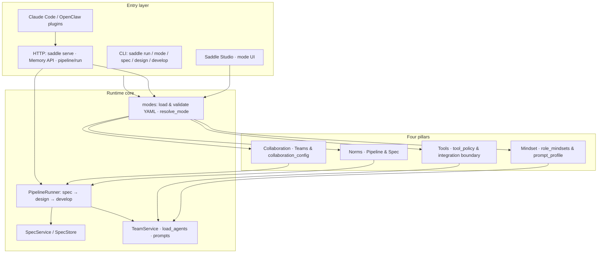

<p align="center">
 
</p>

<h1 align="center">Saddle</h1>

<p align="center">
  <strong>A collaboration paradigm-driven development framework.</strong>
</p>
<p align="center">Decouple specification, design, and implementation; version collaboration modes and built-in team orchestration; turn a one-line requirement into an executable North Star roadmap.</p>

<p align="center"><a href="./README.zh.md">中文 README</a></p>

<p align="center">
  <a href="./LICENSE"></a>
  
</p>

---

## What Saddle is

Saddle is a development framework **centered on collaboration paradigms**. It splits delivery into three stages that can evolve independently or run as a pipeline: **`spec` → `design` → `develop`**. Each stage is shaped by a **Mode**: pipeline order, deep-loop settings and iteration caps, agent selection strategy, thresholds, tool policy, optional role mindsets, and optional **`collaboration_config`** (groups and primitives). That **pins down “how the team collaborates” in the repo** instead of scattering conventions across chat logs.


The framework ships with orchestration protocols and capability tables for a **standard design team (`designteam`)** and a **standard engineering team (`clawteam`)**. With a **short natural-language requirement**, the default path yields:

- **Spec**: structured specification text, task breakdown, and acceptance checklist (written as Markdown + JSON; see “North Star bundle” below).
- **Design**: multi-role design orchestration prompt plus agent selection (ready to plug into a human–agent loop).
- **Develop**: multi-role engineering orchestration prompt plus agent selection (iterable on its own or combined with a spec summary).

Together these form a **standard, relatively complete project development map** (we call it the **North Star bundle**): an **alignment anchor** for deeper implementation, while each stage can be **re-run alone**, with different modes or thresholds, without rebuilding context from scratch. For collaboration primitives, see **[`docs/COLLABORATION_CONFIG.md`](./docs/COLLABORATION_CONFIG.md)** ([中文](./docs/COLLABORATION_CONFIG.zh.md)); for modes and CLI, **[`docs/MODES.md`](./docs/MODES.md)**.

---

## North Star bundle (overview)

| Stage | Intuition | Typical outputs (conceptual) |
|-------|------------|------------------------------|
| **Spec** | Clarify scope, split work, define acceptance | Spec body, task list, checklist, machine-readable metadata |
| **Design** | Align and hand off across design roles | Selection result, deep-loop settings, **full orchestration prompt** (for an external agent) |
| **Develop** | Land and close out engineering work | Same shape; team is **`clawteam`** |


The **`saddle run`** JSON aggregates **timing and key metadata** per stage (`spec_dir` for spec; `selected_agents`, `deep_loop`, `max_iters` for design/develop). To get the **full `prompt` text** for design/develop directly, use **`saddle design`** / **`saddle develop`** (or call orchestration from your HTTP/plugin integration). **Directory- and file-level details** are in **[Outputs (North Star bundle, detailed)](#outputs-north-star-bundle-detailed)** at the end of this document.

---

## The Saddle model: four pillars

Saddle reduces “how to do AI-assisted development well” to **four configurable pillars**, each mapped to parts of the codebase.

| Pillar | Meaning | Where it lives (summary) |
|--------|---------|---------------------------|
| **Norms** | Stages, spec/task shape, acceptance | `pipeline` / `spec`; `SpecService` + `.saddle/specs/` on disk |
| **Collaboration** | Team protocol, selection, deep loop, primitives, handoff | `TeamService` (designteam / clawteam); `collaboration_config`; `PipelineRunner` |
| **Mindset** | Role framing and prompt size | `role_mindsets`; `prompt_profile` (full / compact) |
| **Tools** | Capability bounds and risk posture | `tool_policy`; HTTP / plugins / Studio |

### Architecture pillar diagram (conceptual)

From **entry points** through the **four pillars** to **core modules**—use this to navigate docs and source.



---

## Technical architecture (brief)

- **Language & packaging**: Python **≥ 3.11**; editable install below.  
- **Modes**: `.saddle/modes/*.yaml` describes the collaboration paradigm; `saddle.modes` parses, merges defaults, normalizes `collaboration_config`, and validates.  
- **Pipeline**: `PipelineRunner` follows `pipeline.order` and calls the **spec service** and **team orchestration**; design/develop inputs may include a **spec summary (first 400 characters)** for alignment.  
- **Spec subsystem**: `SpecService` builds a `SpecBundle`; `SpecStore` writes under the project storage root (prefer `.saddle`; see `storage_paths`).  
- **Orchestration**: `TeamService` parses clawcode-style args, loads `.saddle/agents/*.md` plus built-in capability maps, assembles the long prompt, and writes run metadata to `.saddle/runs/`.  
- **Serving**: `saddle serve` exposes REST (modes, memories, pipeline, etc.) via FastAPI; optionally hosts built **Studio** static assets.  
- **Plugins**: Claude Code / OpenClaw talk to the local API over HTTP (similar shape to EverOS-style plugins) and **do not replace** the full surface of `python -m saddle`.

---

## Contents

| Section | Description |
|---------|-------------|
| [Requirements](#requirements) | Python / Node versions |
| [Installation](#installation) | Virtualenv and editable install |
| [Deployment](#deployment) | `saddle serve`, Studio build, ports |
| [Usage tutorials](#usage-tutorials) | Validate modes, pipeline, Studio, subcommands |
| [Using Claude Code and OpenClaw](#claude-openclaw) | Plugins and HTTP |
| [Configuration](#configuration) | Doc index |
| [Testing](#testing) | pytest, plugins, Studio |
| [Outputs (North Star bundle, detailed)](#outputs-north-star-bundle-detailed) | On-disk artifacts and JSON fields |
| [Troubleshooting](#troubleshooting) | Common environment issues |
| [Contributing and thanks](#contributing-and-thanks) | PR conventions and community |

---

## Requirements

| Component | Version |
|-----------|---------|
| Python | **≥ 3.11** (matches `requires-python` in `pyproject.toml`) |
| Node.js | **≥ 18** (recommended for building / developing Studio) |

---

## Installation

Commands below assume the **cloned repo subdirectory `saddle/`** as the project root (contains `pyproject.toml`, `src/`).

### 1. Create a virtual environment (recommended)

```bash
cd saddle
python -m venv .venv
```

**Windows**

```powershell
.\.venv\Scripts\Activate.ps1
```

**macOS / Linux**

```bash
source .venv/bin/activate
```

### 2. Install Saddle (editable)

**With dev dependencies (pytest, httpx, etc.):**

```bash
python -m pip install -e ".[dev]"
```

**Runtime only:**

```bash
python -m pip install -e .
```

### 3. Verify the CLI

```bash
python -m saddle --help
```

If Python’s `Scripts` directory is on your `PATH`:

```bash
saddle --help
```

> **Tip**: Pair **`python -m pip`** with **`python -m saddle`** so you never mix “pip installed to A, python points to B”.

---

## Deployment

### 1. `saddle serve` (API + optional Studio)

From a project root that contains `.saddle/modes`:

```bash
cd /path/to/your/project
saddle serve
```

| Item | Default | Notes |
|------|---------|--------|
| Bind address | `127.0.0.1` | First positional argument is `host` |
| Port | `1995` | Second positional argument is `port` |
| Studio static dir | Resolved automatically if unset (e.g. `studio/dist`) | See below |

**Point to a Studio build output** (directory with `index.html` after `npm run build`):

```bash
saddle serve --studio-dir D:\path\to\studio\dist
```

Or set **`SADDLE_STUDIO_DIR`** to the same path.

**Custom bind:**

```bash
python -m saddle serve 0.0.0.0 8080
```

### 2. Suggested production flow

1. Install on server or CI: `python -m pip install .` (or install a wheel).  
2. Align the business repo (with `.saddle/modes/*.yaml`) and the working directory.  
3. Build Studio: `cd saddle/studio && npm ci && npm run build`.  
4. Start: `saddle serve --studio-dir /absolute/path/to/studio/dist` (or `SADDLE_STUDIO_DIR`).  
5. For HTTPS / public DNS, put **Nginx / Caddy** in front of **`saddle serve`** (no TLS in this repo).

### 3. Studio-only dev (no API deploy)

For UI work only:

```bash
cd saddle/studio
npm install
npm run dev
```

Default **http://localhost:4173/**; config route **`/studio`**.  
**Save / validate modes** needs **`/api/v1/modes`** from **`saddle serve`**; with Vite alone, configure a proxy or change the API base in `studio/src/api/modes.ts`.

---

## Usage tutorials

### Tutorial A: CLI — modes + pipeline

1. **Cd to your repo root** (or `saddle/` for a demo) and ensure **`.saddle/modes/`** exists (this repo ships `default` / `fast` / `deep`, etc.).  
2. **List modes**: `python -m saddle mode list`  
3. **Show resolved config**: `python -m saddle mode show default`  
4. **Validate** (non-zero exit on failure): `python -m saddle mode validate default`  
5. **Run the default pipeline**: `python -m saddle run "Your requirement" --mode fast`  
6. **Temporary overrides without editing YAML**:

```bash
python -m saddle run "Your requirement" ^
  --mode default ^
  --set develop.max_iters=20
```

(On Linux / macOS use `\` for line continuation instead of `^`.)

### Tutorial B: Edit modes in the browser and save YAML

1. Start **`saddle serve`** as in [Deployment](#deployment) and **`npm run build`** in `studio` (or proxy dev to the API).  
2. Open **http://127.0.0.1:1995/studio** (adjust port if needed).  
3. Load a template, edit forms and collaboration settings, **Validate** then **Save**; confirm **`.saddle/modes/<name>.yaml`** on disk.  
4. Re-run **`saddle mode validate <name>`** in the terminal.

### Tutorial C: Design / develop orchestration (includes full `prompt`)

```bash
python -m saddle design "Your design-stage input"
python -m saddle develop "Your develop-stage input"
```

`designteam` / `clawteam` are backward-compatible aliases. JSON output includes a **`prompt`** field for copying into external agents or custom tooling.

### Tutorial D: Spec bundle only

```bash
python -m saddle spec "Your requirement"
```

---

<h2 id="claude-openclaw">Using Claude Code and OpenClaw</h2>

Saddle ships a **Python CLI**, **`saddle serve` HTTP**, and optional **official-style plugin packages** (similar to [EverOS](https://github.com/EverMind-AI/EverOS)-style integration: Claude Code with `plugin.json` + hooks; OpenClaw with `context-engine`). Plugins use **`SADDLE_BASE_URL`** to reach the local API and **do not replace** using `python -m saddle` directly in a terminal.

**HTTP contract and environment variables**: **[`docs/PLUGIN_HTTP.md`](./docs/PLUGIN_HTTP.md)**.

| Approach | Description |
|----------|-------------|
| **Claude Code plugin** | [`plugins/claude-code-plugin/`](./plugins/claude-code-plugin/README.md) — session memory injection and persistence; slash **`/saddle:run`** calls **`POST /api/v1/pipeline/run`** (same pipeline as CLI; requires **`saddle serve`**) |
| **OpenClaw plugin** | [`plugins/openclaw-plugin/`](./plugins/openclaw-plugin/README.md) — `registerContextEngine`, same Memory API; **`saddle-run-once`** / HTTP can trigger the pipeline (see plugin README) |
| **No plugin** | Terminal or any HTTP client to `/api/v1/modes`, etc. |

### Shared prerequisites

1. Python **≥ 3.11** where the **agent can run shell commands**, with `pip install -e .` (or `pip install .`) as in [Installation](#installation).  
2. Prefer **`python -m saddle`**, or add **`Scripts`** to `PATH` and use **`saddle`**.  
3. Repo root has **`.saddle/modes/*.yaml`**, aligned with the workspace the tool opens.  
4. For **memory plugins**: start **`saddle serve`** at the **project root** (default `127.0.0.1:1995`); set **`SADDLE_GROUP_ID` / `SADDLE_USER_ID`** if needed (see `PLUGIN_HTTP.md`).

### Claude Code (Anthropic Claude Code)

1. **Plugin**: follow [`plugins/claude-code-plugin/README.md`](./plugins/claude-code-plugin/README.md); needs local **`saddle serve`** and Node **≥ 18**.  
2. **CLI only**: `python -m pip install -e /path/to/saddle` in the same Python env Claude Code uses.  
3. **Verify**: `python -m saddle --help`.  
4. **Day to day**: `python -m saddle mode validate default`, `python -m saddle run "…" --mode fast`, etc.  
5. **Suggestion**: document default mode, whether **`saddle serve`** is required, and **`.saddle/modes`** in root **`CLAUDE.md`**.

### OpenClaw

1. **Plugin**: install **`@saddle/openclaw-plugin`** per [`plugins/openclaw-plugin/README.md`](./plugins/openclaw-plugin/README.md); configure `openclaw.json` (`plugins.load.paths` / `plugins.allow`).  
2. **Terminal only**: ensure **`python -m saddle`** works in the agent shell.  
3. **HTTP**: with **`saddle serve`**, use **`/api/v1/modes`**, **`/api/v1/memories/*`** (same as Studio; see `saddle/studio/src/api/modes.ts`).

### Debugging tips

- **`saddle` not found**: standardize on **`python -m saddle`** and one Python install for both **`python`** and **`pip`**.  
- **Sandbox**: allow **Python and venv** in the sandbox, or run commands from a local / CI terminal.

---

## Configuration

| Topic | Doc |
|-------|-----|
| Mode paths, CLI overrides, `--set`, common keys, Studio | **[`docs/MODES.md`](./docs/MODES.md)** |
| `collaboration_config`: groups, primitives, `operation_primitives`, YAML examples | **[English](./docs/COLLABORATION_CONFIG.md)** · **[中文](./docs/COLLABORATION_CONFIG.zh.md)** |
| Plugin and HTTP safety | **[`docs/PLUGIN_HTTP.md`](./docs/PLUGIN_HTTP.md)** |

Default pipeline order: **`spec → design → develop`** (change with `pipeline.order`).

---

## Testing

**Python (repo root `saddle/`):**

```bash
python -m pip install -e ".[dev]"
python -m pytest
```

**Claude Code / OpenClaw plugins (Node ≥ 18, no extra deps):**

```bash
cd saddle/plugins/openclaw-plugin && npm test
cd saddle/plugins/claude-code-plugin && npm test
```

**CI:** [`.github/workflows/saddle-ci.yml`](../.github/workflows/saddle-ci.yml) at the **repository root** runs Python and both plugin tests when `saddle/**` changes.

**Studio frontend:**

```bash
cd saddle/studio
npm install
npm test
npm run build
```

---

## Outputs (North Star bundle, detailed)

What lands on disk and in **`saddle run`** / **`POST /api/v1/pipeline/run`** JSON after a typical run—so you can treat Saddle as a **roadmap generator + orchestrator** in your own agent stack.

### 1. Storage root

Spec and some metadata go through **`resolve_write_path`**: prefer **`<project>/.saddle/`**; the implementation may fall back across **`.claw` / `.clawcode` / `.claude`** for reads (see `src/saddle/storage_paths.py`). Below assumes **`.saddle`**.

### 2. Spec stage (norms bundle)

`SpecService.create_bundle` creates a session directory under **`project/.saddle/specs/`**, named like:

`spec-<first 8 chars of session_id>-<timestamp>/`

Files inside:

| File | Description |
|------|-------------|
| **`spec.md`** | Spec body (raw request, goals, constraints, etc.) |
| **`tasks.md`** | Task list (Markdown; default T1–T3 and status) |
| **`checklist.md`** | Acceptance checklist (Markdown) |
| **`meta.json`** | Full serialized `SpecBundle` (tasks, checklist, execution state, …) |

After the spec stage, **`saddle run`** includes **`spec_dir`** and **`session_id`** in `stages[].output` for scripting. For spec only: **`saddle spec`**.

### 3. Design / Develop stages (collaboration artifacts)

**`TeamService.orchestrate`** handles team runs:

- **`design`** → **`designteam`**; **`develop`** → **`clawteam`**.  
- Each run writes **`project/.saddle/runs/designteam-<session_id>.json`** or **`clawteam-<session_id>.json`** with `team`, `deep_loop`, `max_iters`, `selected_agents`, `request`, timestamp, etc. (**not** the full long prompt).  
- **Full orchestration prompt**: emitted by **`saddle design`** / **`saddle develop`** (see `TeamResult.prompt`). **`saddle run`’s JSON** keeps only metadata such as `selected_agents`, `deep_loop`, `max_iters` to stay small. To persist the full prompt in a North Star workflow, wrap **`design` / `develop`** or your own integration.

With **deep loop**, the orchestrator keeps pending state; **`finalize`** can parse `DEEP_LOOP_WRITEBACK_JSON` from an assistant reply into **`.saddle/learning/`** (see `TeamService.finalize`).

### 4. `saddle run` / HTTP `pipeline/run` response (rolled-up)

Top-level fields typically include:

- **`mode`**: mode name used.  
- **`session_id`**: shared across stages (joins `specs/` and `runs/`).  
- **`stages`**: ordered results with **`stage`**, **`ok`**, **`elapsed_ms`**, **`output`**.  

Treat the **four spec files** + **matching `runs/*.json`** + (optionally) **subcommand `prompt` output** as the **full North Star bundle** for aligning spec–design–develop artifacts and iterating any stage independently.

---

## Troubleshooting

| Symptom | Fix |
|---------|-----|
| `No module named saddle` | Use **`python -m pip install -e .`** with **`python -m saddle`** on the **same** interpreter; avoid Windows Store stub `python` mixed with a real env. |
| `saddle` is not a command | Add **`…\Scripts`** to `PATH`, or always use **`python -m saddle`**. |
| `python -m saddle` failed from a parent directory | Use a checkout that includes the repo-root **`__init__.py` / `__main__.py` shim**; if unsure, **`cd saddle`** first. |
| Studio cannot save | Ensure **`saddle serve`** is up and **`/api/v1/modes`** is reachable from the browser. |

---

## Contributing and thanks

Thanks to everyone who files issues, opens PRs, and improves docs—your feedback keeps the paradigms and tooling closer to how real teams work.

- **Small fixes**: docs, tests, localized bugfixes → PRs welcome.  
- **Large or breaking changes**: open an **Issue** first to agree on goals and migration.  
- **PRs with AI assistance**: run tests locally and note tools/models in the description.  
- **Commits**: prefer `type(scope): subject`, e.g. `fix(modes): validate pipeline order`.

Saddle is evolving quickly: **build and explore with us**—whether tuning default paradigms, improving Studio, or wiring orchestration into more hosts, feel free to sketch ideas in an Issue and land them in small PRs.

---

## License

[MIT](./LICENSE)
