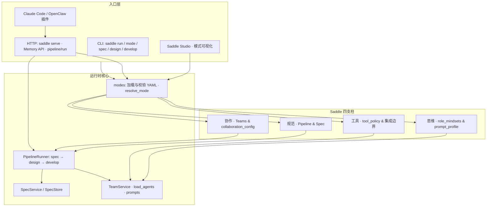

<p align="center">
 
</p>

<h1 align="center">Saddle</h1>

<p align="center">
  <strong>协作范式驱动开发框架</strong>
</p>
<p align="center">解耦规范、设计与实现，用可版本化的模式与内置团队编排，把一句需求铺成可执行的「北极星」路线图。</p>

<p align="center"><a href="./README.en.md">English README</a></p>

<p align="center">
  <a href="./LICENSE"></a>
  
</p>


---

## Saddle 是什么

Saddle 是一个**以协作范式为核心**的开发框架：它把软件交付拆成 **`spec`（规范）→ `design`（设计协作）→ `develop`（工程协作）** 三条可独立演进、又可按流水线串联的阶段。每一阶段由**模式（Mode）**描述：流水线顺序、深循环与轮次、角色选择策略、阈值、工具策略、角色思维补充，以及可选的 **`collaboration_config`**（分组与原语），从而在仓库里**固化「团队怎么协作」**，而不是把约定散落在聊天里。

框架已内置**标准设计团队（designteam）**与**标准开发团队（clawteam）**的编排协议与能力表；用户只需输入**简短自然语言需求**，即可在默认链路下得到：

- **规范阶段**：结构化的规格说明、任务拆解与验收清单（落盘为 Markdown + JSON，见下文「北极星资料包」）。
- **设计阶段**：面向多角色设计的编排提示与选人结果（可与后续人机协作闭环衔接）。
- **开发阶段**：面向工程多角色的编排提示与选人结果（同样可独立迭代或与 spec 摘要组合使用）。

由此形成一份**标准且相对完备的项目开发地图**（下文称为**北极星资料包**）：它既是后续深度实现的**对齐锚点**，也支持各阶段**单独重跑、调模式、调阈值**而不必从零重写上下文。更细的协作原语配置见 **[`docs/COLLABORATION_CONFIG.zh.md`](./docs/COLLABORATION_CONFIG.zh.md)**（[English](./docs/COLLABORATION_CONFIG.md)）；模式与 CLI 见 **[`docs/MODES.md`](./docs/MODES.md)**。

---

## 北极星资料包（简述）

| 阶段 | 用户直觉 | 典型产出（概念） |
|------|------------|------------------|
| **Spec** | 「要把什么说清楚、拆成什么任务、怎么验收」 | 规格正文、任务列表、检查单与机器可读元数据 |
| **Design** | 「多设计角色如何对齐与交接」 | 选人结果、深循环参数、**完整编排提示词**（供外部智能体执行） |
| **Develop** | 「多工程角色如何落地与收口」 | 同上，团队为工程向 **clawteam** |

**流水线一键命令** `saddle run` 的 JSON 会汇总各阶段**耗时与关键元数据**（spec 含 `spec_dir`；design/develop 含 `selected_agents`、`deep_loop`、`max_iters`）。若需要**直接拿到 design/develop 的完整 `prompt` 文本**，请使用 **`saddle design`** / **`saddle develop`**（或集成 HTTP/插件侧自行调用编排服务）。**资料包目录与文件级说明**见文末 **[产出结果说明（资料包详版）](#产出结果说明资料包详版)**。

---

## Saddle 模型：四支柱

Saddle 将「如何把 AI 辅助开发做对」收敛为四个可配置的支柱，并在实现上分别对应不同子系统（与仓库目录大致对应）。

| 支柱 | 含义 | 实现落点（概要） |
|------|------|------------------|
| **规范** | 阶段划分、规格与任务结构、验收口径 | `pipeline` / `spec`；`SpecService` + `.saddle/specs/` 落盘 |
| **协作** | 团队协议、选人、深循环、协作原语与交接语义 | `TeamService`（designteam / clawteam）；`collaboration_config`；`PipelineRunner` |
| **思维** | 角色心智与提示体量 | `role_mindsets`；`prompt_profile`（full / compact） |
| **工具** | 能力边界与风险偏好 | `tool_policy`；HTTP / 插件 / Studio 对接 |

### 架构支柱图（概念）

下图从**用户入口**到**四支柱**再到**核心模块**，便于把文档与代码对照阅读。



---

## 技术架构（简述）

- **语言与包**：Python **≥ 3.11**；可编辑安装见下文。  
- **模式系统**：`.saddle/modes/*.yaml` 描述整条协作范式；`saddle.modes` 负责解析、合并默认值、`collaboration_config` 归一化及校验。  
- **流水线**：`PipelineRunner` 按模式中的 `pipeline.order` 依次调用 **规格服务** 与 **团队编排服务**；design/develop 输入可附带 spec 摘要（前 400 字）以保持对齐。  
- **规格子系统**：`SpecService` 生成 `SpecBundle`，由 `SpecStore` 写入项目存储根（优先 `.saddle`，见 `storage_paths`）。  
- **编排子系统**：`TeamService` 解析 clawcode 风格参数、加载 `.saddle/agents/*.md` 与内置能力表、组装长提示词，并将运行元数据写入 `.saddle/runs/`。  
- **对外服务**：`saddle serve` 基于 FastAPI 暴露 REST（模式、记忆、流水线等）；可选托管构建后的 **Studio** 静态资源。  
- **插件**：Claude Code / OpenClaw 通过 HTTP 与本机 API 协同（形态可与 EverOS 式插件对齐），**不替代**本地 `python -m saddle` 的完整能力。

---

## 目录

| 章节 | 说明 |
|------|------|
| [环境要求](#环境要求) | Python / Node 版本 |
| [安装](#安装) | 虚拟环境与可编辑安装 |
| [部署](#部署) | `saddle serve`、Studio 构建与端口 |
| [应用教程](#应用教程) | 模式校验、流水线、Studio、子命令 |
| [在 Claude Code 与 OpenClaw 中使用](#claude-openclaw) | 插件与 HTTP |
| [配置说明](#配置说明) | 文档索引 |
| [测试](#测试) | pytest、插件与 Studio |
| [产出结果说明（资料包详版）](#产出结果说明资料包详版) | spec / design / develop 落盘与 JSON 字段 |
| [故障排除](#故障排除) | 常见环境问题 |
| [参与贡献与致谢](#参与贡献与致谢) | PR 约定与社区欢迎 |

---

## 环境要求

| 组件 | 版本 |
|------|------|
| Python | **≥ 3.11**（与 `pyproject.toml` 中 `requires-python` 一致） |
| Node.js | **≥ 18**（推荐，用于构建 / 开发 Studio） |

---

## 安装

以下命令均以**克隆后的本仓库子目录 `saddle/`** 为项目根（含 `pyproject.toml`、`src/`）。

### 1. 创建虚拟环境（推荐）

```bash
cd saddle
python -m venv .venv
```

**Windows**

```powershell
.\.venv\Scripts\Activate.ps1
```

**macOS / Linux**

```bash
source .venv/bin/activate
```

### 2. 安装 Saddle（可编辑）

**开发依赖（含 pytest、httpx）：**

```bash
python -m pip install -e ".[dev]"
```

**仅运行时：**

```bash
python -m pip install -e .
```

### 3. 验证 CLI

```bash
python -m saddle --help
```

若已将 Python 的 `Scripts` 目录加入 `PATH`，可直接：

```bash
saddle --help
```

> **建议**：始终用 **`python -m pip`** 与 **`python -m saddle`** 配对，避免「`pip` 装到 A、`python` 指向 B」导致找不到模块。

---

## 部署

### 1. `saddle serve`（API + 可选 Studio）

在项目根（含 `.saddle/modes` 的仓库）启动：

```bash
cd /path/to/your/project
saddle serve
```

| 项 | 默认值 | 说明 |
|----|--------|------|
| 监听地址 | `127.0.0.1` | 第一个参数为 `host` |
| 端口 | `1995` | 第二个参数为 `port` |
| Studio 静态目录 | 未设置则按实现查找 `studio/dist` 等 | 见下 |

**指定 Studio 构建产物目录**（`npm run build` 后含 `index.html` 的目录）：

```bash
saddle serve --studio-dir D:\path\to\studio\dist
```

或设置环境变量 **`SADDLE_STUDIO_DIR`** 指向同一目录。

**自定义监听：**

```bash
python -m saddle serve 0.0.0.0 8080
```

### 2. 生产环境建议流程

1. 在服务器或 CI 中安装：`python -m pip install .`（或从 wheel 安装）。  
2. 将业务仓库（含 `.saddle/modes/*.yaml`）与运行目录对齐。  
3. 构建 Studio：`cd saddle/studio && npm ci && npm run build`。  
4. 启动：`saddle serve --studio-dir /absolute/path/to/studio/dist`（或使用 `SADDLE_STUDIO_DIR`）。  
5. 对外若需 HTTPS / 域名，在 **`saddle serve` 前** 加一层 **Nginx / Caddy** 反向代理（本仓库不内置 TLS）。

### 3. Studio 单独开发（不部署 API）

仅本地调 UI 时：

```bash
cd saddle/studio
npm install
npm run dev
```

默认 **http://localhost:4173/** ，配置页路由为 **`/studio`**。  
**保存 / 校验模式**依赖后端 **`/api/v1/modes`**；仅开 Vite 时需自行配置代理或改 `studio/src/api/modes.ts` 中的 API 基址，使浏览器能访问已启动的 `saddle serve`。

---

## 应用教程

### 教程 A：命令行跑通「模式 + 流水线」

1. **进入你的业务仓库根**（或本仓库 `saddle/` 根用于演示），确认存在 **`.saddle/modes/`**（本仓库已带 `default` / `fast` / `deep` 等模板）。  
2. **列出模式**：`python -m saddle mode list`  
3. **查看合并后的配置**：`python -m saddle mode show default`  
4. **校验模式**（失败时退出码非 0）：`python -m saddle mode validate default`  
5. **执行默认流水线**：`python -m saddle run "你的需求描述" --mode fast`  
6. **临时改参数不重写 YAML**：

```bash
python -m saddle run "你的需求描述" ^
  --mode default ^
  --set develop.max_iters=20
```

（Linux / macOS 将 `^` 换为 `\` 续行。）

### 教程 B：浏览器里改模式并写回 YAML

1. 按 [部署](#部署) 启动 **`saddle serve`**，并完成 **`studio` 的 `npm run build`**（或开发时代理到该 API）。  
2. 浏览器打开 **http://127.0.0.1:1995/studio**（端口以你启动命令为准）。  
3. 在 Studio 中加载模板、编辑表单与协作配置、点 **校验** 再 **保存**，确认磁盘上 **`.saddle/modes/<name>.yaml`** 已更新。  
4. 回到终端用 **`saddle mode validate <name>`** 再次确认无报错。

### 教程 C：单独调用设计 / 开发编排（含完整 `prompt`）

```bash
python -m saddle design "你的设计阶段输入"
python -m saddle develop "你的开发阶段输入"
```

`designteam` / `clawteam` 为向后兼容别名，行为与上相同。输出 JSON 中含 **`prompt`** 字段，便于复制到外部智能体或自建工具链。

### 教程 D：仅生成规格包

```bash
python -m saddle spec "你的需求描述"
```

---

<h2 id="claude-openclaw">在 Claude Code 与 OpenClaw 中使用</h2>

Saddle 提供 **Python CLI**、**`saddle serve` HTTP**，以及可选的 **官方形态插件包**（与 [EverOS](https://github.com/EverMind-AI/EverOS) 式集成类似：Claude Code 用 `plugin.json` + hooks；OpenClaw 用 `context-engine`）。插件均通过 **`SADDLE_BASE_URL`** 访问本地 API，**不替代**你在终端里直接使用 `python -m saddle`。

**HTTP 契约与环境变量**见 **[`docs/PLUGIN_HTTP.md`](./docs/PLUGIN_HTTP.md)**。

| 方式 | 说明 |
|------|------|
| **Claude Code 插件** | [`plugins/claude-code-plugin/`](./plugins/claude-code-plugin/README.md) — 会话记忆注入与落盘；斜杠 **`/saddle:run`** 经 **`POST /api/v1/pipeline/run`** 触发与 CLI 相同的流水线（需先 **`saddle serve`**） |
| **OpenClaw 插件** | [`plugins/openclaw-plugin/`](./plugins/openclaw-plugin/README.md) — `registerContextEngine`，对接同一 Memory API；也可用 **`saddle-run-once`** / HTTP 触发流水线（见插件 README） |
| **无插件** | 仅用终端或任意 HTTP 客户端调 `/api/v1/modes` 等 |

### 共性前提

1. 在 **Agent 能执行终端命令** 的环境里装好 Python **≥ 3.11**，并按上文 [安装](#安装) 完成 `pip install -e .`（或 `pip install .`）。  
2. 让该环境能执行 **`python -m saddle`**（推荐），或把 **`Scripts`** 加入 `PATH` 后使用 **`saddle`**。  
3. 业务仓库根目录具备 **`.saddle/modes/*.yaml`**，与你在工具里打开的工作区一致。  
4. 使用 **记忆类插件** 时：在**项目根**先启动 **`saddle serve`**（默认 `127.0.0.1:1995`），并设置 **`SADDLE_GROUP_ID` / `SADDLE_USER_ID`**（可选，见 `PLUGIN_HTTP.md`）。

### Claude Code（Anthropic Claude Code）

1. **插件**：按 [`plugins/claude-code-plugin/README.md`](./plugins/claude-code-plugin/README.md) 添加 marketplace 并安装；依赖本机 **`saddle serve`** 与 Node **≥ 18**。  
2. **仅 CLI**：在 Claude Code 所使用终端的同一 Python 环境中执行 `python -m pip install -e /path/to/saddle`。  
3. **验证**：`python -m saddle --help`。  
4. **日常使用**：`python -m saddle mode validate default`、`python -m saddle run "需求描述" --mode fast` 等。  
5. **建议**：在仓库根 **`CLAUDE.md`** 里写清默认模式、`saddle serve` 是否必需、以及 **`.saddle/modes`** 约定。

### OpenClaw

1. **插件**：按 [`plugins/openclaw-plugin/README.md`](./plugins/openclaw-plugin/README.md) 安装 **`@saddle/openclaw-plugin`**（或从本仓库路径加载），配置 `openclaw.json` 中的 `plugins.load.paths` / `plugins.allow`。  
2. **仅终端**：保证 Agent 调用的 shell 里可用 **`python -m saddle`**。  
3. **HTTP**：启动 **`saddle serve`** 后访问 **`/api/v1/modes`**、**`/api/v1/memories/*`**（与 Studio 一致；前端可参考 `saddle/studio/src/api/modes.ts`）。

### 排错提示

- **「找不到 saddle」**：在工具里统一用 **`python -m saddle`**，并确认 **`python` 与 `pip` 为同一安装**。  
- **权限 / 沙箱**：若 Agent 在受限沙箱中执行命令，需把 **Python 与 venv** 纳入允许列表，或改为在 CI / 本机终端由人执行同一命令。

---

## 配置说明

| 主题 | 文档 |
|------|------|
| 模式文件路径、CLI 覆盖、`--set` 语法、常用键、Studio 启动说明 | **[`docs/MODES.md`](./docs/MODES.md)** |
| `collaboration_config`：分组、原语、`operation_primitives`、YAML 示例 | **[`docs/COLLABORATION_CONFIG.zh.md`](./docs/COLLABORATION_CONFIG.zh.md)** · **[English](./docs/COLLABORATION_CONFIG.md)** |
| 插件与 HTTP 安全约定 | **[`docs/PLUGIN_HTTP.md`](./docs/PLUGIN_HTTP.md)** |

默认流水线顺序：**`spec → design → develop`**（可通过 `pipeline.order` 调整）。

---

## 测试

**Python（仓库根 `saddle/`）：**

```bash
python -m pip install -e ".[dev]"
python -m pytest
```

**Claude Code / OpenClaw 插件（Node ≥ 18，无额外依赖）：**

```bash
cd saddle/plugins/openclaw-plugin && npm test
cd saddle/plugins/claude-code-plugin && npm test
```

**CI：** 在 **本仓库根目录** 下 [`.github/workflows/saddle-ci.yml`](../.github/workflows/saddle-ci.yml)（变更位于 `saddle/**` 时运行 Python 与两个插件的测试）。

**Studio 前端：**

```bash
cd saddle/studio
npm install
npm test
npm run build
```

---

## 产出结果说明（资料包详版）

本节描述一次典型运行后，磁盘上与 **`saddle run` / `POST /api/v1/pipeline/run` 返回 JSON** 中会出现的内容，便于你把 Saddle 当作「路线图生成器 + 编排器」接入自己的 Agent 流水线。

### 1. 存储根路径

规格与部分元数据写入 **`resolve_write_path`** 解析的目录：优先 **`项目根/.saddle/`**；若不存在，会按实现回退读取 **`.claw` / `.clawcode` / `.claude`**（详见 `src/saddle/storage_paths.py`）。下文以 **`.saddle`** 为主说明。

### 2. Spec 阶段（规范资料包）

`SpecService.create_bundle` 会在 **`项目根/.saddle/specs/`** 下创建会话目录，目录名形如：

`spec-<session_id 前 8 位>-<时间戳>/`

其内文件：

| 文件 | 说明 |
|------|------|
| **`spec.md`** | 规格正文（含用户原始需求、目标与约束等） |
| **`tasks.md`** | 任务列表（Markdown，含默认 T1–T3 任务与状态） |
| **`checklist.md`** | 验收检查单（Markdown） |
| **`meta.json`** | 完整 `SpecBundle` 的机器可读序列化（任务、检查项、执行状态等） |

**`saddle run`** 在 spec 阶段结束后的 `stages[].output` 中会包含 **`spec_dir`** 与 **`session_id`**，便于脚本定位该资料包。仅跑规格可用 **`saddle spec`**。

### 3. Design / Develop 阶段（协作编排资料）

团队编排由 **`TeamService.orchestrate`** 完成：

- **`design`** 对应团队 **`designteam`**；**`develop`** 对应 **`clawteam`**。  
- 每次编排会在 **`项目根/.saddle/runs/`** 写入 **`designteam-<session_id>.json`** 或 **`clawteam-<session_id>.json`**，内容包含：`team`、`deep_loop`、`max_iters`、`selected_agents`、`request`、时间戳等（不含完整长提示词）。  
- **完整编排提示词**：由 `saddle design` / `saddle develop`（及内部 `TeamResult.prompt`）输出；**`saddle run` 的 JSON 汇总**中为减轻体积，**仅包含** `selected_agents`、`deep_loop`、`max_iters` 等元数据。若你的「北极星」工作流需要保存全文提示，请在流水线外对 **`design` / `develop` 子命令** 或自建封装落盘。

**深循环（deep loop）** 时，编排器会维护 pending 状态；**`finalize`** 可将助手回复中的 `DEEP_LOOP_WRITEBACK_JSON` 解析并写入 **`.saddle/learning/`**（详见 `TeamService.finalize`）。

### 4. `saddle run` / HTTP `pipeline/run` 返回体（汇总视角）

顶层字段通常包括：

- **`mode`**：使用的模式名。  
- **`session_id`**：本次会话 id（各阶段一致，便于关联 `specs/` 与 `runs/`）。  
- **`stages`**：按顺序排列的阶段结果；每项含 **`stage`**、`ok`、`elapsed_ms`、`output`**。  

将 **Spec 目录中的四文件** + **`runs/` 下对应 JSON** +（可选）**子命令输出的 `prompt`** 视为一次运行的**完整北极星资料包**，即可在团队内对齐「规范—设计—开发」三层产物，并独立迭代任一阶段。

---

## 故障排除

| 现象 | 处理 |
|------|------|
| `No module named saddle` | 使用 **`python -m pip install -e .`** 与 **`python -m saddle`**，确保同一解释器；避免 Windows 商店占位 `python` 与真实环境混用。 |
| `saddle` 不是内部或外部命令 | 将安装输出中的 **`…\Scripts`** 加入 `PATH`，或统一使用 **`python -m saddle`**。 |
| 在上级目录执行 `python -m saddle` 曾报错 | 请使用包含仓库根 **`__init__.py` / `__main__.py` shim** 的版本；仍异常时可先 **`cd saddle`** 再执行。 |
| Studio 无法保存 | 确认 **`saddle serve`** 已启动且浏览器能访问 **`/api/v1/modes`**。 |

---

## 参与贡献与致谢

感谢每一位提交 Issue、PR 与文档改进的贡献者；你们的反馈让协作范式与工具链更贴近真实团队节奏。

- **小修复**：文档、测试、局部 bugfix 可直接提 PR。  
- **大功能 / 破坏性变更**：建议先开 **Issue** 对齐目标与迁移方式。  
- **含 AI 辅助改动的 PR**：请自行跑通测试，并在描述中注明所用工具与模型。  
- **提交信息**：推荐 `type(scope): subject`，例如 `fix(modes): validate pipeline order`。

Saddle 仍在快速演进：欢迎你**一起开发、一起探索**——无论是打磨默认范式、增强 Studio、还是把编排接到更多宿主环境，都可以在 Issue 里先抛想法，再小步落地成 PR。

---

## 许可证

[MIT](./LICENSE)
